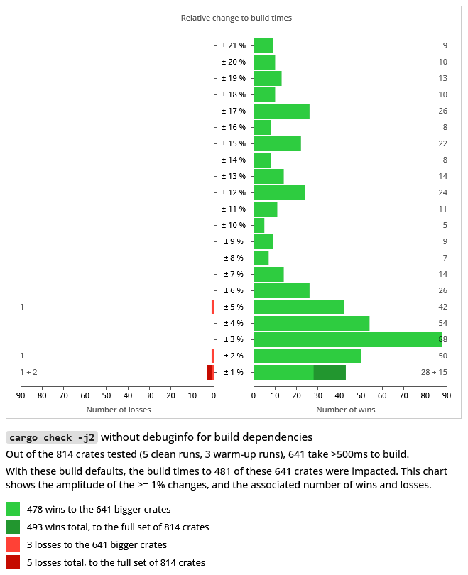

### Cargo build defaults: removing debuginfo for build dependencies

Cargo builds "for host" dependencies for speed of compilation, rather than throughput, because build scripts and proc-macros are generally short-lived, and the performance of code compiled without optimizations is good enough in that situation: making a faster build time and slower run time a better choice than slower build time and faster run time.

We can expand on that idea (in order of importance/cost) for check/debug builds:
- build dependencies are built with debuginfo, but it's rare to actually be able to debug them, and showing a backtrace is sometimes not even doable on stable. We can detect a build script failure to run, and show a message asking to increase the debuginfo level if a precise backtrace would be helpful.
- asking for the artifacts be stripped, especially on platforms where the linker can avoid copying debuginfo (rather than stripping after the fact). This is so that the debuginfo that's always present in the stdlib is not copied to the resulting binaries. (That's safer than stripping symbols altogether, but of course a tiny bit slower than that)
- in some cases of having local build dependencies, and not ones from crates.io, disabling incremental compilation could save a small amount of time.

This experiment implements the first idea in that list. There is however a side-effect of changing the defaults.

Currently, cargo offers some amount of re-use for built artifacts: if the target platform and the host platform are the same, everything built for one can be reused for the other. Therefore, dependencies that are used as part of both the build dependencies subgraph, and the runtime dependencies subgraphs can only be built once, instead of twice. That should be relatively uncommon in my opinion but definitely exists. `cargo-crev` is an example where many dependencies for parsing rust code and so on are shared between the build and runtime parts of the tool.

Changing defaults for the build dependencies would inhibit that reuse:
- build dependencies would ask rustc to not emit debuginfo
- runtime dependencies would ask rustc debuginfo=2
- the dependencies that are shared would be built twice to satisfy the above

This experiment tries to work around this issue by deferring the choice of debuginfo: the default values set by the profile can be overriden once we detect if there's build time and run time sharing in the graph we're trying to build. If some sharing happens, we ask rustc to use the currently used value in order to only build the unit once. But if no sharing is present in the graph, and only in that situation, it's safe to optimize the build dependency unit by removing its debuginfo level.

Since this applies to clean builds, we'll want to have an eye on the low core counts results, since that will be especially adapted to CI builder configurations (especially on the free tiers, e.g. github actions offer free builders with 2 cores).

### Experiment

The results that follow were gathered running hyperfine, with 5 clean runs (and 3 warm-up runs): check builds at j1, j2, j4, j6 and j8. 

They were ran over the 800 popular crates.io crates or so benchmarked in this repository.

There is a small amount of noise present in the results, especially on the tiny crates (either by design or requiring feature flags). There are generally a little (a couple dozen) so I've left them in the visualizations, but differentiate the crates that took 500ms build (around 650 or so; in the lighter shade of red and green), but the summary and raw data is available for every one. The text summaries and complete hyperfine outputs also contain their confidence range. These results are not intended to be a super precise evaluation of the prototype, but to show the positive trend we expected by asking rustc to do less work, and its significance.

The charts show the amplitude percentage of the change to build times (positive and negative; when a change occurred, so >0%), and the associated number of wins and losses at that amplitude (respectively, on the right-side and left-side of the chart).

The chart shows the normalized amplitude as percentages, while the summary and raw data from hyperfine has them relative to the other, à la "1.15 times faster" to mean a win/loss of around 13%. They also identify today's cargo as the "baseline cargo" and this experiment's prototype as "custom cargo" (so the summaries will look like "publicsuffix-2.1.1 1.15 ± 0.03 times faster than 'baseline cargo check -j2'").

The small number of losses are mostly due to noise and outliers to my eyes, as we can see in the summaries and hyperfine outputs: the amplitude is usually small, the change is usually within the confidence range, and outliers skew the average whereas the minimum runs are comparable. The small additional work done in cargo to check for re-use looks inconsequential on this dataset.

(A run was also done for debug builds at j8, and can be made available if need be: it's so similar to the others that I didn't feel the need to visualize the results)

#### 1. `cargo check -j1`

To clarify this one, and the following charts, here's an example on how it's read: there were 75 crates where build times improved by 5%. There where 33 crates improved by 1%: 23 main ones, and 10 that took less than 500ms. There were 3 crates that saw a 1% loss: 0 main ones, and 3 that took less than 500ms.

Here are links to:
- sorted summaries of changes to all the tested crates: [wins only](./summaries/summary-check-j1-wins-all.txt), [losses only](./summaries/summary-check-j1-losses-all.txt)
- [the 800+ hyperfine outputs](./summaries/hyperfine/check/j1/)

#### 2. `cargo check -j2`

Here again, here's an example on how to read the chart. There were:
- 28 "slow to build" crates where build times were improved by 1%, and 15 with the same improvement but built in less than 500ms.
- 1 "slow to build" crate saw a 1% loss, and 2 with the same loss but built in less than 500ms.

Here are links to:
- sorted summaries of changes to all the tested crates: [wins only](./summaries/summary-check-j2-wins-all.txt), [losses only](./summaries/summary-check-j2-losses-all.txt)
- [the 800+ hyperfine outputs](./summaries/hyperfine/check/j2/)

#### 3. `cargo check -j4`

Here are links to:
- sorted summaries of changes to all the tested crates: [wins only](./summaries/summary-check-j4-wins-all.txt), [losses only](./summaries/summary-check-j4-losses-all.txt)
- [the 800+ hyperfine outputs](./summaries/hyperfine/check/j4/)

#### 4. `cargo check -j6`

Here are links to:
- sorted summaries of changes to all the tested crates: [wins only](./summaries/summary-check-j6-wins-all.txt), [losses only](./summaries/summary-check-j6-losses-all.txt)
- [the 800+ hyperfine outputs](./summaries/hyperfine/check/j6/)

#### 5. `cargo check -j8`

Here are links to:
- sorted summaries of changes to all the tested crates: [wins only](./summaries/summary-check-j8-wins-all.txt), [losses only](./summaries/summary-check-j8-losses-all.txt)
- [the 800+ hyperfine outputs](./summaries/hyperfine/check/j8/)