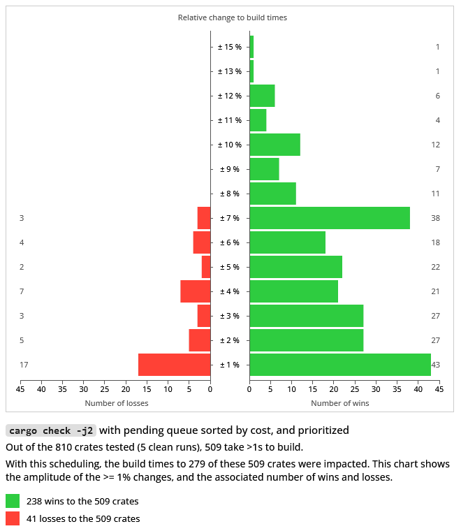
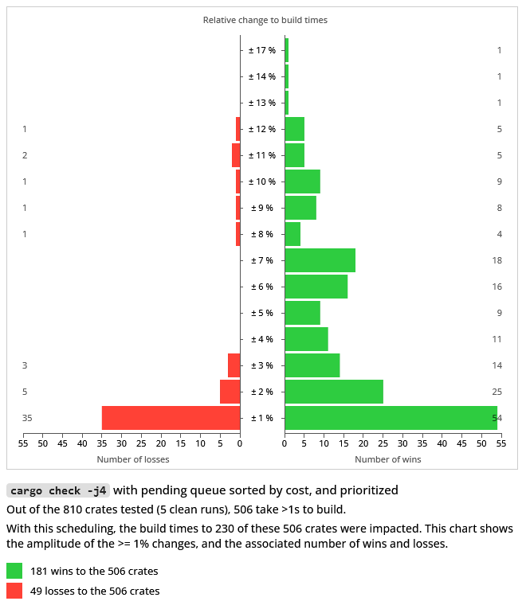
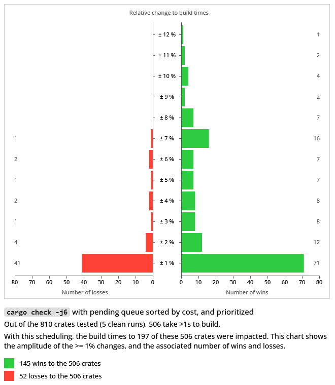
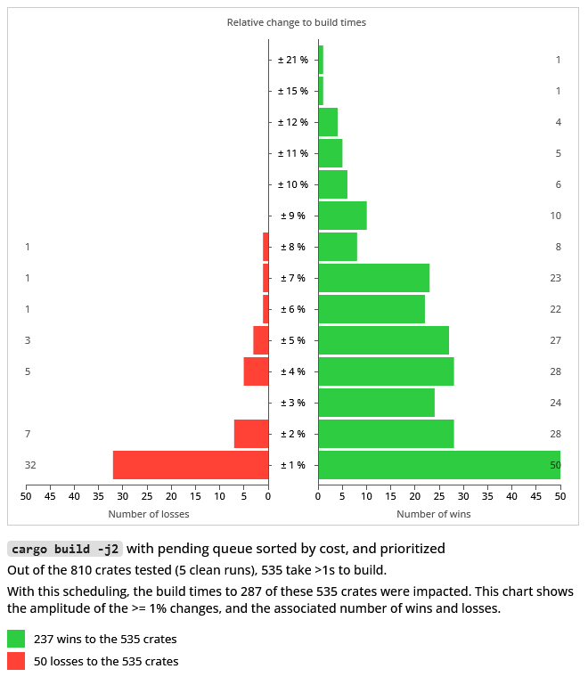
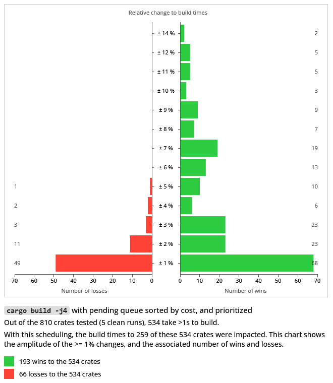
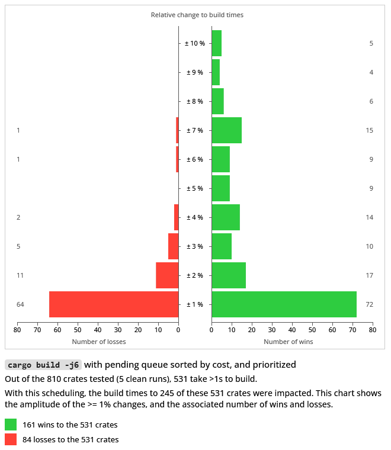

### Cargo scheduling: cost-ordered pending queue and prioritizing some popular proc-macro crates and their dependants

This is an extension to the [other scheduling experiment](../pending-queue-sorted/) of ordering the pending queue according to each crate's cost/priority. In this case, we're trying to prioritize some crates over others: popular proc-macro crates and their dependants. 

The manually overriden priorities in this experiment are for these crates:
- `syn`
- `quote`
- `serde_derive`
- `proc-macro2`
- `unicode-xid`

Since most of them are proc-macros they have some inhibiting effect on pipelining: they require codegen and linking, and are not super quick to build. Any improvements there should be felt throughout the ecosystem because of their popularity (e.g. `syn` is depended on by around 50% of the crates.io ecosystem).

The idea is similar in spirit to (in addition to the previous experiment):
- "Experiment with giving higher priority to proc-macros and their dependencies" https://github.com/rust-lang/cargo/issues/8370 
- "Provide scheduling hints?" https://github.com/rust-lang/cargo/issues/7437

The goal being to move the serializing nodes that these proc-macros create earlier in the pipeline. I didn't expect #8370 (but haven't tried) to be a universal win moving _all_ proc-macros earlier in the pipeline, for every project out there (more precisely: e.g. syn heavily benefits from multiple codegen threads, and building it earlier, when there are more parallelism opportunities, can make it build slower) so I tried this approach inspired by #7437 of being able to pick the problematic crates in your dependency graph and see if tackling them earlier improves things. This was to allow each project to try to tailor the scheduling to their specific dev machines/CI builder configuration (I'm not sure if that's a good idea).

The prototype tries to do this with a hack: marking them 10x more costly than the regular crates to ensure the cost-ordering picks them first.

### Experiment

The results that follow were gathered running hyperfine, with 5 clean runs (which is also a common occurence for CI builders): check and debug builds, at j2, j4, and j6.

They were ran over the 800 popular crates.io crates or so benchmarked in this repository.

The results can be noisy at the low-end, so the visualizations are only the changes to the crates that took at least 1s to build (around 500 or so), but summary and raw data is available for every one. The text summaries and complete hyperfine outputs also contain their confidence range. These results are not intended to be a super precise evaluation of the simplistic prototype, but to show a trend (hopefully).

Since there are both wins and losses, the charts show the amplitude percentage of the change to build times (positive and negative; when a change occurred, so >0%), and the associated number of wins and losses at that amplitude (respectively, on the right-side and left-side of the chart).

The chart shows the normalized amplitude as percentages, while the summary and raw data from hyperfine has them relative to the other, à la "1.15 times faster" to mean a win/loss of around 13%. They also identify today's cargo as the "baseline cargo" and the scheduling prototype as "custom cargo" (so the summaries will look like "publicsuffix-2.1.1 1.15 ± 0.03 times faster than 'baseline cargo check -j2'")

It seems the results are an improvement over the previous experiment: the losses' amplitudes are dampened while the wins are bigger. The number of negatively impacted crates is generally decreased, while the number of positively impacted crates is generally increased.

#### Check builds

1. `cargo check -j2`

To clarify this one, and the following charts, here's an example on how it's read: there were 36 crates where build times improved by 2%, and 10 that saw a 2% loss.

Here are links to:
- sorted summaries for the "slow to build" crates: [wins only](./summaries/summary-check-j2-wins-prioritized.txt), [losses only](./summaries/summary-check-j2-losses-prioritized.txt), [both wins and losses combined](./summaries/summary-check-j2-prioritized.txt)
- sorted summaries of changes to all the tested crates: [wins only](./summaries/summary-check-j2-wins-all-prioritized.txt), [losses only](./summaries/summary-check-j2-losses-all-prioritized.txt), [both wins and losses combined](./summaries/summary-check-j2-all-prioritized.txt)
- [the 800+ hyperfine outputs](./summaries/hyperfine/check/j2/)

2. `cargo check -j4`

Here are links to:
- sorted summaries for the "slow to build" crates: [wins only](./summaries/summary-check-j4-wins-prioritized.txt), [losses only](./summaries/summary-check-j4-losses-prioritized.txt), [both wins and losses combined](./summaries/summary-check-j4-prioritized.txt)
- sorted summaries of changes to all the tested crates: [wins only](./summaries/summary-check-j4-wins-all-prioritized.txt), [losses only](./summaries/summary-check-j4-losses-all-prioritized.txt), [both wins and losses combined](./summaries/summary-check-j4-all-prioritized.txt)
- [the 800+ hyperfine outputs](./summaries/hyperfine/check/j4/)

3. `cargo check -j6`

Here are links to:
- sorted summaries for the "slow to build" crates: [wins only](./summaries/summary-check-j6-wins-prioritized.txt), [losses only](./summaries/summary-check-j6-losses-prioritized.txt), [both wins and losses combined](./summaries/summary-check-j6-prioritized.txt)
- sorted summaries of changes to all the tested crates: [wins only](./summaries/summary-check-j6-wins-all-prioritized.txt), [losses only](./summaries/summary-check-j6-losses-all-prioritized.txt), [both wins and losses combined](./summaries/summary-check-j6-all-prioritized.txt)
- [the 800+ hyperfine outputs](./summaries/hyperfine/check/j6/)

#### Debug builds

1. `cargo build -j2`

Here are links to:
- sorted summaries for the "slow to build" crates: [wins only](./summaries/summary-build-j2-wins-prioritized.txt), [losses only](./summaries/summary-build-j2-losses-prioritized.txt), [both wins and losses combined](./summaries/summary-build-j2-prioritized.txt)
- sorted summaries of changes to all the tested crates: [wins only](./summaries/summary-build-j2-wins-all-prioritized.txt), [losses only](./summaries/summary-build-j2-losses-all-prioritized.txt), [both wins and losses combined](./summaries/summary-build-j2-all-prioritized.txt)
- [the 800+ hyperfine outputs](./summaries/hyperfine/build/j2/)

2. `cargo build -j4`

Here are links to:
- sorted summaries for the "slow to build" crates: [wins only](./summaries/summary-build-j4-wins-prioritized.txt), [losses only](./summaries/summary-build-j4-losses-prioritized.txt), [both wins and losses combined](./summaries/summary-build-j4-prioritized.txt)
- sorted summaries of changes to all the tested crates: [wins only](./summaries/summary-build-j4-wins-all-prioritized.txt), [losses only](./summaries/summary-build-j4-losses-all-prioritized.txt), [both wins and losses combined](./summaries/summary-build-j4-all-prioritized.txt)
- [the 800+ hyperfine outputs](./summaries/hyperfine/build/j4/)

3. `cargo build -j6`

Here are links to:
- sorted summaries for the "slow to build" crates: [wins only](./summaries/summary-build-j6-wins-prioritized.txt), [losses only](./summaries/summary-build-j6-losses-prioritized.txt), [both wins and losses combined](./summaries/summary-build-j6-prioritized.txt)
- sorted summaries of changes to all the tested crates: [wins only](./summaries/summary-build-j6-wins-all-prioritized.txt), [losses only](./summaries/summary-build-j6-losses-all-prioritized.txt), [both wins and losses combined](./summaries/summary-build-j6-all-prioritized.txt)
- [the 800+ hyperfine outputs](./summaries/hyperfine/build/j6/)