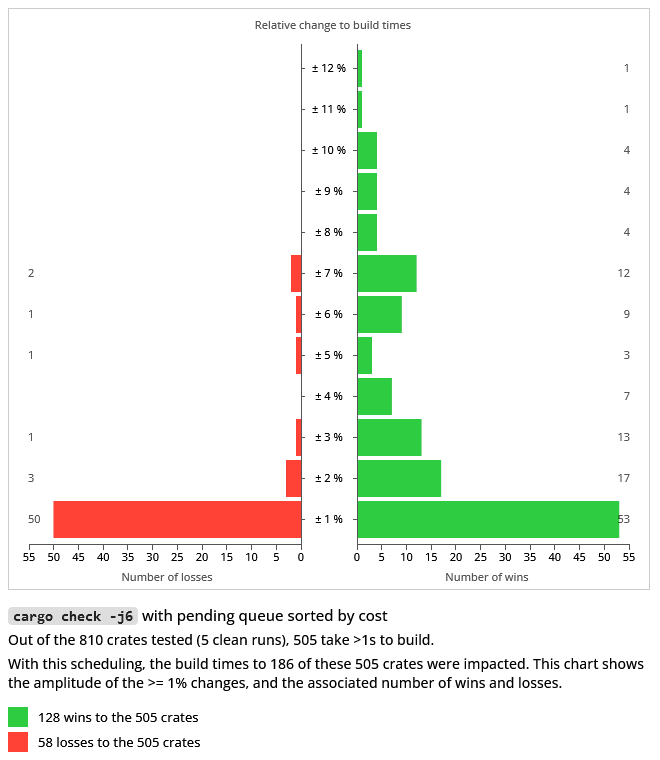
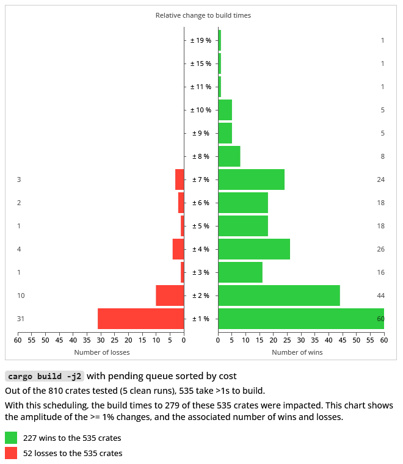

### Cargo scheduling: cost-ordered pending queue

Cargo's pending queue holds the units of work that are waiting to start (e.g. waiting for a jobserver token), their dependencies are taken care of and are just waiting for a jobserver token.

At low core-counts, with enough dependencies, this buffer can accumulate a number of waiting jobs. Currently, it is a queue and the first job added to the queue will be the first to be dequeued and worked on. This experiment tries to choose a better crate to pick if there are multiple ones waiting. 

There's already a notion of cost per unit of work in cargo: it's synthethic (always 100) but is used to compute a priority (as the cost of a unit of work and all the units that depend on it). This cost/priority is taken into account when a job is now ready to be built and dequeued from the dependency queue: the highest priority job is dequeued, and transferred to the pending queue.

So the pending queue will contain jobs with different costs, but doesn't use it to choose the next job to build. This experiment uses the cost/priority to sort the pending queue, so that the highest cost/priority jobs are picked first. The hope is that this makes bigger dependency subgraphs processed sooner, and brings more parallelism opportunities are earlier in the pipeline.

Since this is in effect a scheduling change to bias attributing jobserver tokens towards some jobs, it only has effect under contention: this is why the experiment was ran at j6 and lower. At j8 contention seemed more rare, the number of jobs waiting was low, but some extremely wide dependency graphs could see some impact here.

Interestingly, "low core counts" describes many CI builder configurations. And there, some contention is expected with a sufficient number of dependencies.

### Experiment

The results that follow were gathered running hyperfine, with 5 clean runs (which is also a common occurence for CI builders): check and debug builds, at j2, j4, and j6.

There were ran over the 800 popular crates.io crates or so benchmarked in this repository.

The results can be noisy at the low-end, so the visualizations are only the changes to the crates that took at least 1s to build (around 500 or so), but summary and raw data is available for every one. The text summaries and complete hyperfine outputs also contain their confidence range. These results are not intended to be a super precise evaluation of the simplistic prototype, but to show a trend (hopefully).

Since there were both wins and losses, the charts show the amplitude percentage of the change to build times (positive and negative; when a change occurred, so >0%), and the associated number of wins and losses at that amplitude (respectively, on the right-side and left-side of the chart).

The chart shows the normalized amplitude as percentages, while the summary and raw data from hyperfine has them relative to the other, à la "1.10 times faster" to mean a win/loss of around 9%. They also identify today's cargo as the "baseline cargo" and the scheduling prototype as "custom cargo" (so the summaries will look like "publicsuffix-2.1.1 1.15 ± 0.03 times faster than 'baseline cargo check -j2'")

#### Check builds

1. `cargo check -j2`

To clarify this one, and the following charts, here's an example on how it's read: there were 36 crates where build times improved by 2%, and 10 that saw a 2% loss.

Here are links to:
- sorted summaries for the "slow to build" crates: [wins only](./summaries/summary-check-j2-wins-sorted.txt), [losses only](./summaries/summary-check-j2-losses-sorted.txt), [both wins and losses combined](./summaries/summary-check-j2-sorted.txt)
- sorted summaries of changes to all the tested crates: [wins only](./summaries/summary-check-j2-wins-all-sorted.txt), [losses only](./summaries/summary-check-j2-losses-all-sorted.txt), [both wins and losses combined](./summaries/summary-check-j2-all-sorted.txt)
- [the 800+ hyperfine outputs](./summaries/hyperfine/check/j2/)

2. `cargo check -j4`

Here are links to:
- sorted summaries for the "slow to build" crates: [wins only](./summaries/summary-check-j4-wins-sorted.txt), [losses only](./summaries/summary-check-j4-losses-sorted.txt), [both wins and losses combined](./summaries/summary-check-j4-sorted.txt)
- sorted summaries of changes to all the tested crates: [wins only](./summaries/summary-check-j4-wins-all-sorted.txt), [losses only](./summaries/summary-check-j4-losses-all-sorted.txt), [both wins and losses combined](./summaries/summary-check-j4-all-sorted.txt)
- [the 800+ hyperfine outputs](./summaries/hyperfine/check/j4/)

3. `cargo check -j6`

Here are links to:
- sorted summaries for the "slow to build" crates: [wins only](./summaries/summary-check-j6-wins-sorted.txt), [losses only](./summaries/summary-check-j6-losses-sorted.txt), [both wins and losses combined](./summaries/summary-check-j6-sorted.txt)
- sorted summaries of changes to all the tested crates: [wins only](./summaries/summary-check-j6-wins-all-sorted.txt), [losses only](./summaries/summary-check-j6-losses-all-sorted.txt), [both wins and losses combined](./summaries/summary-check-j6-all-sorted.txt)
- [the 800+ hyperfine outputs](./summaries/hyperfine/check/j6/)

#### Debug builds

1. `cargo build -j2`

Here are links to:
- sorted summaries for the "slow to build" crates: [wins only](./summaries/summary-build-j2-wins-sorted.txt), [losses only](./summaries/summary-build-j2-losses-sorted.txt), [both wins and losses combined](./summaries/summary-build-j2-sorted.txt)
- sorted summaries of changes to all the tested crates: [wins only](./summaries/summary-build-j2-wins-all-sorted.txt), [losses only](./summaries/summary-build-j2-losses-all-sorted.txt), [both wins and losses combined](./summaries/summary-build-j2-all-sorted.txt)
- [the 800+ hyperfine outputs](./summaries/hyperfine/build/j2/)

2. `cargo build -j4`

Here are links to:
- sorted summaries for the "slow to build" crates: [wins only](./summaries/summary-build-j4-wins-sorted.txt), [losses only](./summaries/summary-build-j4-losses-sorted.txt), [both wins and losses combined](./summaries/summary-build-j4-sorted.txt)
- sorted summaries of changes to all the tested crates: [wins only](./summaries/summary-build-j4-wins-all-sorted.txt), [losses only](./summaries/summary-build-j4-losses-all-sorted.txt), [both wins and losses combined](./summaries/summary-build-j4-all-sorted.txt)
- [the 800+ hyperfine outputs](./summaries/hyperfine/build/j4/)

3. `cargo build -j6`

Here are links to:
- sorted summaries for the "slow to build" crates: [wins only](./summaries/summary-build-j6-wins-sorted.txt), [losses only](./summaries/summary-build-j6-losses-sorted.txt), [both wins and losses combined](./summaries/summary-build-j6-sorted.txt)
- sorted summaries of changes to all the tested crates: [wins only](./summaries/summary-build-j6-wins-all-sorted.txt), [losses only](./summaries/summary-build-j6-losses-all-sorted.txt), [both wins and losses combined](./summaries/summary-build-j6-all-sorted.txt)
- [the 800+ hyperfine outputs](./summaries/hyperfine/build/j6/)